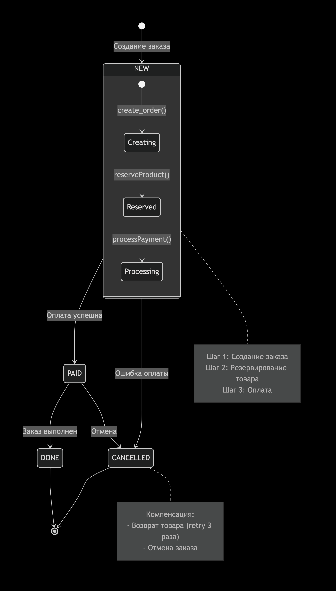

№	Шаг	Метод	Описание	Статус после шага
1	Создание заказа	create_order()	Создается запись о заказе в системе. Заказ получает статус NEW	NEW
2	Резервирование товара	reserveProduct()	Проверяется наличие товара на складе и резервируется указанное количество	NEW (промежуточный)
3	Списание денег	processPayment()	Производится списание средств с карты клиента. Если сумма ≤ 10000 - успех, если > 10000 - ошибка	PAID (успех) или CANCELLED (ошибка)

